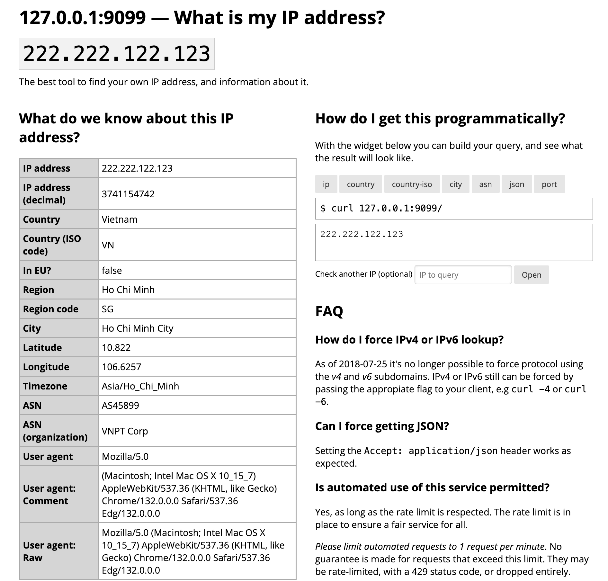

# network-ipinfo

> The best tool to find your own IP address, and information about it.


A simple service for looking up your IP address.
What do we know about this IP address?
This is the code that powers https://ifconfig.co. Public Source from ifconfig.co



## Dockerize

A Docker Compose config might look like this

```
version: "3.8"
services:
  echoip:
    image: mpolden/echoip
    command: >
      -l 0.0.0.0:8080
      -a /data/GeoLite2-ASN.mmdb
      -c /data/GeoLite2-City.mmdb
      -f /data/GeoLite2-Country.mmdb
    ports:
      - "8080:8080"
    volumes:
      - "./:/data"
    restart: unless-stopped
```

Extract geolite-data: `tar -xzf geolite-data.tar.gz`
Running docker at port 9099: `docker-compose up`

Data files:

- [GeoLite2-ASN](https://github.com/wp-statistics/GeoLite2-ASN)
- [GeoLite2-Country](https://github.com/wp-statistics/GeoLite2-Country)
- [GeoLite2-City](https://github.com/wp-statistics/GeoLite2-City)

## Usage

Just the business, please:

```
$ curl ifconfig.co
127.0.0.1

$ http ifconfig.co
127.0.0.1

$ wget -qO- ifconfig.co
127.0.0.1

$ fetch -qo- https://ifconfig.co
127.0.0.1

$ bat -print=b ifconfig.co/ip
127.0.0.1
```

Country and city lookup:

```
$ curl ifconfig.co/country
Elbonia

$ curl ifconfig.co/country-iso
EB

$ curl ifconfig.co/city
Bornyasherk

$ curl ifconfig.co/asn
AS59795

$ curl ifconfig.co/asn-org
Hosting4Real
```

As JSON:

```
$ curl -H 'Accept: application/json' ifconfig.co  # or curl ifconfig.co/json
{
  "city": "Bornyasherk",
  "country": "Elbonia",
  "country_iso": "EB",
  "ip": "127.0.0.1",
  "ip_decimal": 2130706433,
  "asn": "AS59795",
  "asn_org": "Hosting4Real"
}
```

Port testing:

```
$ curl ifconfig.co/port/80
{
  "ip": "127.0.0.1",
  "port": 80,
  "reachable": false
}
```

Pass the appropriate flag (usually `-4` and `-6`) to your client to switch
between IPv4 and IPv6 lookup.

## Features

- Easy to remember domain name
- Fast
- Supports IPv6
- Supports HTTPS
- Supports common command-line clients (e.g. `curl`, `httpie`, `ht`, `wget` and `fetch`)
- JSON output
- ASN, country and city lookup using the MaxMind GeoIP database
- Port testing
- All endpoints (except `/port`) can return information about a custom IP address specified via `?ip=` query parameter
- Open source under the [BSD 3-Clause license](https://opensource.org/licenses/BSD-3-Clause)

## Why?

- To scratch an itch
- An excuse to use Go for something
- Faster than ifconfig.me and has IPv6 support

## Building

Compiling requires the [Golang compiler](https://golang.org/) to be installed.
This package can be installed with:

`go install github.com/mpolden/echoip/...@latest`

For more information on building a Go project, see the [official Go
documentation](https://golang.org/doc/code.html).

## Docker image

A Docker image is available on [Docker
Hub](https://hub.docker.com/r/mpolden/echoip), which can be downloaded with:

`docker pull mpolden/echoip`

## [GeoIP](https://www.maxmind.com/en/geoip2-databases)/[GeoLite](https://dev.maxmind.com/geoip/geolite2-free-geolocation-data?) Database (MaxMind)

To utilise MaxMind [GeoIP](https://www.maxmind.com/en/geoip2-databases)/[GeoLite](https://dev.maxmind.com/geoip/geolite2-free-geolocation-data?) database to enhance the information provided to end users, you can download the relevant **binary** databases (`.mmdb` format) directly from MaxMind using the above links.

**Please Note**: This has only been tested using the free, GeoLite database.

### Usage

```
$ echoip -h
Usage of echoip:
  -C int
    	Size of response cache. Set to 0 to disable
  -H value
    	Header to trust for remote IP, if present (e.g. X-Real-IP)
  -a string
    	Path to GeoIP ASN database
  -c string
    	Path to GeoIP city database
  -f string
    	Path to GeoIP country database
  -l string
    	Listening address (default ":8080")
  -p	Enable port lookup
  -r	Perform reverse hostname lookups
  -t string
    	Path to template directory (default "html")
```
